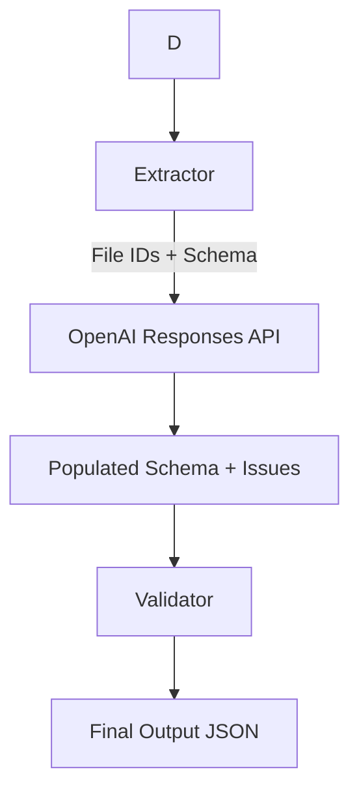

# System Design Overview

## Problem Statement
Extracting data from financial documents is complex due to varied formats and schemas. This system simplifies it by leveraging OpenAI's native multimodal capabilities.

## Architecture

### Technology Stack

- **Language**: Python 3.10+
- **LLM/API**: OpenAI Files + Responses API
- **Models**: `gpt-4o-mini` (or similar multimodal)

## Component Design

### 1. Extractor

**Purpose**: Populate the target schema.
**Function**:
- Constructs a prompt incorporating the full `schema.json`.
- Sends File IDs + Prompt to OpenAI Responses API.
- Receives a fully populated JSON structure + list of issues.

### 2. Validator

**Purpose**: Ensure data quality and correctness.
**Function**:
- Checks for missing critical fields.
- Validates data types and formats (e.g. Dates).
- Integrates LLM-flagged issues with system-detected issues.

## Data Flow

## Key Technical Decisions

### 1. Why OpenAI Files API?

- **Native PDF Support**: No need for `PyPDF2` or `OCR` libraries. OpenAI handles parsing.
- **Multimodal Context**: The model sees the document "visually" or structurally, reducing text extraction artifacts.
- **Simplified Pipeline**: Removed the need for separate Layout Analysis + Text Extraction + Schema Mapping steps.

### 2. Single-Pass Extraction

Instead of extracting raw text -> mapping -> resolving, we give the model the files and the target schema and ask it to fill it. This leverages the model's reasoning to "read" the document and find the right values directly.

### 3. Validation Strategy

While the LLM is powerful, it can make mistakes. The Validator acts as a deterministic guardrail to check:
- Is the output strictly valid JSON conforming to the schema?
- Are dates in YYYY-MM-DD?
- Are numeric fields actually numbers?

## Performance Benchmarks

**Test Setup**: 3 PDF documents, ~2000 words each

| Metric | Value |
| :------------------------ | :--------- |
| Document Processing | 2-3s |
| LLM Extraction (all docs) | 20-30s |
| Schema Mapping | 10-15s |
| Validation | <1s |
| **Total** | **30-50s** |

**Bottlenecks**:

1. LLM API latency (70% of time)
2. PDF text extraction (15% of time)
3. JSON parsing/validation (15% of time)

**Optimization Opportunities**:

- Parallel LLM calls for independent documents
- Local LLM for free processing
